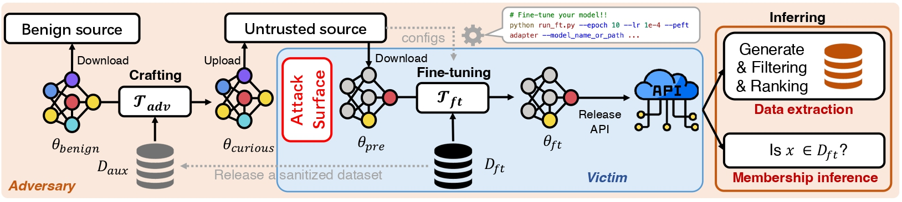

# Overview
Downloading open-sourced pre-trained model and fine-tuning on private dataset becomes a widely adopted training pipeline for language models (LMs).
PreCurious is a framework to escalate the general privacy risk of the fine-tuning dataset by adversarially crafting and releasing the pre-trained model, revealing a new privacy surface to this pipeline.



The goal of our experiments is demonstrating a superior privacy attack effectiveness on a model fine-tuned from the **PreCurious** pre-trained model than the one fine-tuned from a **Benign** pre-trained model. We use the same *fine-tuning* and *privacy evaluation* pipeline for Benign and PreCurious, while only performing the *crafting* stage in PreCurious.

We run experiments on three text datasets (Enron, PTB, Pubmed) and GPT-2 family (GPT-2, GPT-2-medium, GPT-2-large) for text generative task.
The fine-tuning pipeline supports fully fine-tuning and several PEFTs (Adapter-FT, LoRA-FT, Bitfit-FT and Head-FT).

This artifact instruction will guide you through our experimental evaluation step by step with total 20 human-minutes and 50 compute-minutes on an independent demo example, and 30 human-minutes on reuse instructions.


# Getting Started (10 human-minutes + 10 compute-minutes)

## Requirement
- A GPU-capable machine with ubuntu operation system and internet connection. 
  We have tested our code on the following GPU cards: A100, A6000.
- CUDA version >= 12.2
- Make sure docker (with nvidia-container support) is installed on your ubuntu system. If you have not install them or unsure, please follow below instructions:

  (1) Install latest docker engine following https://docs.docker.com/engine/install/ubuntu/

  (2) Install nvidia-container following https://docs.nvidia.com/datacenter/cloud-native/container-toolkit/latest/install-guide.html#configuring-docker

  You can confirm that you have everything ready by running a sample command following https://docs.nvidia.com/datacenter/cloud-native/container-toolkit/latest/sample-workload.html.
  If everything is ok, it should output your GPU card information.

## Download the repository
- Option 1) Download the folder PreCurious [here](https://www.dropbox.com/scl/fo/60cyotu8isc1iu3jy4x3b/AC24DU4hX-buNf-Wgccjs8g?rlkey=c0l53ayrfgr99eadheslqtm8f&st=tflc0lpd&dl=0) and move this folder to your evaluation path.

- Option 2) for terminal users, download via `wget`

  ```shell
  wget -O precurious.zip "https://www.dropbox.com/scl/fo/60cyotu8isc1iu3jy4x3b/AC24DU4hX-buNf-Wgccjs8g?rlkey=c0l53ayrfgr99eadheslqtm8f&st=tflc0lpd&dl=1"
  unzip precurious.zip -d PreCurious
  ```

By default, denote the home path as `HOME_PATH`, we assume the repository is located at `HOME_PATH/PerCurious`, and the huggingface default cache folder is `HOME_PATH`

## Environment setup

(1) Start the docker container with:
  ```
  bash start_docker.sh
  ```
  If everything is ok you should see the following output:
  ```
  ==========
  == CUDA ==
  ==========

  CUDA Version 12.2.2

  Container image Copyright (c) 2016-2023, NVIDIA CORPORATION & AFFILIATES. All rights reserved.

  This container image and its contents are governed by the NVIDIA Deep Learning Container License.
  By pulling and using the container, you accept the terms and conditions of this license:
  https://developer.nvidia.com/ngc/nvidia-deep-learning-container-license

  A copy of this license is made available in this container at /NGC-DL-CONTAINER-LICENSE for your convenience.

  root@YOUR_MACHINE:/workspace#
  ```

  This means the container has started and the code is under `/workspace` folder inside the container.

(2) Init the conda inside the container with:
  ```
  conda init && \
  source /root/.bashrc && \
  conda create --name precurious --file ./environment.yml && \
  conda activate precurious
  ```

(3) Install required python packages with:
  ```
  bash install_pip_packages.sh
  ```
  Once it finished without errors, you are ready to run the experiments!

To exit the container and return to your linux system, please press **Ctrl+D**.

## Dataset setup
**TL;DR: We have prepared a small pre-processed dataset of Enron for quick evaluation. Skip this part if you are not going to manually build and re-process the data.**

We evaluate on three datasets including Penn Treebank (PTB), Enron and Pubmed.
We recommend to use the provided small Enron dataset for quick evaluation.

- Enron via `--dataset_name enron`

  - The complete dataset `emails.csv` can be downloaded from [here](https://www.kaggle.com/datasets/wcukierski/enron-email-dataset) (1.43G)
  - We follows [basic pre-processing steps](https://github.com/mireshghallah/ft-memorization/blob/master/gen/enron/clean_enron.ipynb) and provide a small pre-processed dataset to play with
    - `./cache/datasets/enron/cleaned_short_train_scrubbed.csv` 
    - `./cache/datasets/enron/cleaned_short_train_scrubbed.csv` 

- PTB via `--dataset_name ptb_text_only`

  - The complete dataset will be automatically downloaded to default huggingface dataset path (e.g., `*/huggingface/datasets/`).

- Pubmed via `--dataset_name pubmed`
  - The complete dataset can be obtained via `load_dataset("ccdv/pubmed-summarization", "document")`. It will be automatically downloaded into `./cache/datasets/pubmed_tokenized_*` for the first time.
  - You can tokenize and update the cached path of `./cache/datasets/pubmed_tokenized_*` in `utils.py` to get rid of tokenizing every time.

# Run and Evaluate (10 human-minute + 38 compute-minutes)

We would like to compare the attack effectiveness on the fine-tuned checkpoint obtained from the same fine-tuning procedure with the only difference on parameters of the pre-trained models:

- Benign model $\theta_{ft}^{benign}\leftarrow \mathcal{T}_{ft}(D_{ft}|\theta_{pre}^{benign}, C)$
- PreCurious model $\theta_{ft}^{adv}\leftarrow \mathcal{T}_{ft}(D_{ft}|\theta_{pre}^{adv}, C)$

For the ease of evaluation, we provide an all-in-one pipeline to reproduce main results in Table 1 or Table 2 with one line command. This repository supports attack evaluation of MIA and Data extraction. 

## All-in-one pipeline

(5 human-minutes + 37 compute-minutes)

1. For quickly debugging the pipeline, we sub-select a few samples and finish all steps for Benign and PreCurious in a few seconds. Please run this first:

  ```shell
  cd ./scripts
  bash run_all_debug.sh # 1 compute-minute on A100
  ```

- If this works well, we ensure that you can run the next step smoothly

- If this raises OOM as your GPU memory is limited, please adjust batch size accordingly until it works on your machine:

  ```shell
  --per_device_eval_batch_size 1 \
  --per_device_train_batch_size 1 \
  --gradient_accumulation_steps 8 \
  ```

2. For running the pipeline on the given Enron dataset, please use:

  ```shell
  cd ./scripts
  bash run_all.sh # 36 compute-minutes on A100
  ```

- After running this script, we will get logs and metrics saved in `HOME_PATH/PreCurious/cache/output/*`. If you run the script repeatedly, it will save every runs with time stamps appended in the directory.


## Validate Results

(5 human-minutes + 1 compute-minute)

- Quick validation on results of all-in-one pipeline
    - Run the Jupyter notebook [here](./examples/demo/plot.ipynb) to visualize the ROC_AUC curve. It can reproduce the advantage shown in Table 1-2 when customizing the script with the same settings, which need longer running time than this demo.
    - NOTE: change the `*/metric.json` file with the generated file under `HOME_PATH/PreCurious/cache/output/*` if you customize the parameters in `run_all.sh`.
    
- Visualization of raw results from our full-running experiments on extraction
    - Run the Jupyter notebook [here](./examples/demo/exp_ppl.ipynb) to re-produce figure 13 with our raw results.
    - We obtained the raw results by running separate steps of crafting, DP fine-tuning and evaluating. Please refer to details of each step in the next section.

# Reuse beyond Paper (30 human-minutes)

For the ease of reuse, we elaborate how to run *<u>crafting</u>*, <u>*fine-tuning*</u> and <u>*privacy risk evaluation*</u> separately with more customized configuration. Here are some motivations on reusing this repository:

- Reuse for exploring better crafting methods 
  - You can improve or replace the *<u>Crafting</u>* stage and reuse the Fine-tuning and Evaluation stage by expanding the argument `--attack` in `pre_un_ref.py`.
- Reuse for stress test on other defenses
  - You can apply other privacy defenses in the <u>*Fine-tuning*</u> (i.e., function `train_ft`) stage to evaluate your defense under a worse case than average where the pre-trained model is backdoored by PreCurious.
- Reuse for investigating the generality of PreCurious
  - You can improve or replace the *<u>Evaluating</u>* stage with other stronger/weaker privacy attacks by expanding the function `priv_measure` in fine-tuning loops (e.g., `ft_un.py`).

## Crafting $\theta_{pre}^{adv} \leftarrow \mathcal{T}_{adv}(D_{aux}|\theta_{pre}^{benign},C)$

For Benign baseline, we do not need the crafting step.

PreCurious adversary will leverage an auxiliary dataset $D_{aux}$ (disjoint from $D_{tr}$) to craft the original benign pre-trained model $\theta_{pre}^{benign}$ depending on the stopping criteria $C$ for crafting and releasing the adversarial pre-trained model $\theta_{pre}^{adv}$.

For example, we can crafting the pre-trained model via

```shell
# Accelerating by Warm-up (Case I)
LR=1e-4
PEFT_PRE=full
CUDA_VISIBLE_DEVICES=$device python ../pre_un_ref.py \
    --dataset_name $DATA \
    --model_name_or_path gpt2 \
    --per_device_eval_batch_size 4 \
    --per_device_train_batch_size 4 \
    --gradient_accumulation_steps 2 \
    --peft_pre full --learning_rate_pre $LR \
    --attack warm \
    --pre_aux_ratio 1 --pre_num_epochs 4 \
    --save_ckpt 4

# Accelerating by Anti-Freezing (Case I)
LR=1e-4
PEFT_PRE=adapter
CUDA_VISIBLE_DEVICES=$device python ../pre_un_ref.py \
    --dataset_name $DATA \
    --model_name_or_path gpt2 \
    --per_device_eval_batch_size 4 \
    --per_device_train_batch_size 4 \
    --gradient_accumulation_steps 2 \
    --peft_pre $PEFT_PRE --learning_rate_pre $LR \
    --attack warm \
    --pre_aux_ratio 1 --pre_num_epochs 4 \
    --save_ckpt 4
```
For # Lagging by Weight Scaling (Case II), please load any model obtained from Case I crafting and set `--bad --bad_scale 0.1 --bad_key attn.c_proj.weight` in the fine-tuning stage, as shown latter.

After running either crafting, you will get a model checkpoint trained on the auxiliary dataset and saved at `../cache/output/*`.


## Fine-tuning $\theta_{ft}\leftarrow \mathcal{T}_{ft}(D_\text{ft}|\theta_{pre}, C)$

### Fine-tuning w/o defenses

For Benign, we conduct fine-tuning with $\theta_{pre}^{benign}$ via

```shell
# Fine-tuning on Benign pre-trained model
CUDA_VISIBLE_DEVICES=$device python ../ft_un.py \
    --dataset_name $DATA \
    --model_name_or_path gpt2 \
    --per_device_eval_batch_size 4 \
    --per_device_train_batch_size 4 \
    --gradient_accumulation_steps 2 \
    --peft $PEFT --learning_rate $LR \
    --do_ref_model \
    --num_train_epochs 20 --only_eval_last --save_ft \
    --load_ref_file $REF_MODEL --load_ref_name $REF_MODEL_NAME
```


For PreCurious, we conduct fine-tuning by loading the crafted model obtained in the last step via

```shell
# PreCurious basic / aggressive (Case I)
CUDA_VISIBLE_DEVICES=$device python ../ft_un.py \
    --dataset_name $DATA \
    --model_name_or_path gpt2 \
    --per_device_eval_batch_size 4 \
    --per_device_train_batch_size 4 \
    --gradient_accumulation_steps 2 \
    --peft $PEFT --learning_rate $LR \
    --do_ref_model \
    --num_train_epochs 20 --only_eval_last --save_ft \
    --load_ref_file $REF_MODEL --load_ref_name $REF_MODEL_NAME \
    --load_init_file $PRE_MODEL --load_init_name $PRE_MODEL_NAME

# PreCurious lagging (Case II)
CUDA_VISIBLE_DEVICES=$device python ../ft_un.py \
    --dataset_name $DATA \
    --model_name_or_path gpt2 \
    --per_device_eval_batch_size 4 \
    --per_device_train_batch_size 4 \
    --gradient_accumulation_steps 2 \
    --peft $PEFT --learning_rate $LR \
    --do_ref_model \
    --num_train_epochs 20 --only_eval_last --save_ft \
    --load_ref_file $REF_MODEL --load_ref_name $REF_MODEL_NAME \
    --load_init_file $PRE_MODEL --load_init_name $PRE_MODEL_NAME \
    --bad --bad_scale 0.1 --bad_key attn.c_proj.weight
```

### Fine-tuning w/ defenses

The repository also supports privacy defenses mentioned in our paper:

- **DP training** is supported by [private_transformers](https://github.com/lxuechen/private-transformers):

```shell
# DP fine-tuning on Benign pre-trained model
CUDA_VISIBLE_DEVICES=$device python ../ft_dp.py \
    --dataset_name $DATA \
    --model_name_or_path gpt2 \
    --per_device_eval_batch_size 4 \
    --per_device_train_batch_size 4 \
    --gradient_accumulation_steps 2 \
    --peft $PEFT --learning_rate $LARGE_LR \
    --do_ref_model \
    --num_train_epochs $E --only_eval_last --save_ft \
    --dp_eps $eps --dp_norm $NORM

# DP fine-tuning on PreCurious pre-trained model
CUDA_VISIBLE_DEVICES=$device python ../ft_dp.py \
    --dataset_name $DATA \
    --model_name_or_path gpt2 \
    --per_device_eval_batch_size 4 \
    --per_device_train_batch_size 4 \
    --gradient_accumulation_steps 2 \
    --peft $PEFT --learning_rate $LARGE_LR \
    --do_ref_model \
    --num_train_epochs $E --only_eval_last --save_ft \
    --load_init_file $CKPT4 --load_init_name CKPT4 \
    --load_ref_file $CKPT4 --load_ref_name CKPT4 \
    --dp_eps $eps --dp_norm $NORM
```

- **weight decay** is supported by configuing `--weight_decay_def $WD_SCALE` in `ft_un.py`
- **deduplication** is supported by loading a tokenized `datasets.Dataset` deduplicated by any deduplication tools such as [deduplicate-text-datasets](https://github.com/google-research/deduplicate-text-datasets) via `--train_dir` before fine-tuning starts for either Benign or PreCurious fine-tuning:
```shell
# Example of loading a deduplicated training dataset
CUDA_VISIBLE_DEVICES=$device python ../train_all.py \
    --dataset_name $DATA \
    --model_name_or_path gpt2 \
    --per_device_eval_batch_size 4 \
    --per_device_train_batch_size 4 \
    --gradient_accumulation_steps 2 \
    --peft $PEFT --learning_rate $LR \
    --num_train_epochs 5 --only_eval_last \
    --peft_pre $PEFT_PRE --learning_rate_pre $LR_PRE \
    --pre_aux_ratio 1 --pre_num_epochs 3 \
    --do_ref_model --tune_ref \
    --train_dir $TRAIN_DIR \
    --org_train
```

## Privacy Evaluation

### Compare rule
The comparison rule depends on the stopping criteria $C$:

- Case I (stopping by epoch), we compare the final fine-tuned checkpoint of Benign and PreCurious given a fixed epoch.
- Case II (early stopping by performance), we evaluate the fine-tuned checkpoint at every epoch by turning off `--only_eval_last` and compare Benign and PreCurious checkpoints under the same performance.

### Privacy risks
**MIA.** Our fine-tuning loop supports MIA evalution at every epoch. Or you can use the argument `--only_eval_last` to only evaluate at the end of fine-tuning.

**Data extraction.** You can load a model fine-tuned (either Benign or PreCurious) on Enron and get the exposure value as follows:

```shell
# Load Benign fine-tuned model and get exposure
CUDA_VISIBLE_DEVICES=$device python ../exp_email.py \
    --dataset_name $DATA \
    --model_name_or_path gpt2 \
    --per_device_eval_batch_size 4 \
    --per_device_train_batch_size 4 \
    --gradient_accumulation_steps 2 \
    --pre_aux_ratio 1 \
    --peft adapter --peft_pre full \
    --load_ft_file $FT_BENIGN --load_ft_name $FT_BENIGN_NAME

# Load PreCurious fine-tuned model and get exposure
CUDA_VISIBLE_DEVICES=$device python ../exp_email.py \
    --dataset_name $DATA \
    --model_name_or_path gpt2 \
    --per_device_eval_batch_size 4 \
    --per_device_train_batch_size 4 \
    --gradient_accumulation_steps 2 \
    --pre_aux_ratio 1 \
    --peft adapter --peft_pre full \
    --load_ft_file $FT_ADV --load_ft_name $FT_ADV_NAME \
    --load_init_file $PRE_ADV --load_init_name $PRE_ADV_NAME
```

# References

If you find this repository useful, please cite us:

```latex
@article{liu2024precurious,
  title={PreCurious: How Innocent Pre-Trained Language Models Turn into Privacy Traps},
  author={Liu, Ruixuan and Wang, Tianhao and Cao, Yang and Xiong, Li},
  journal={arXiv preprint arXiv:2403.09562},
  year={2024}
}
```

We acknowledge the contributions of the following repositories:

- [private_transformers](https://github.com/lxuechen/private-transformers)
- [ft-memorization](https://github.com/mireshghallah/ft-memorization)

```latex
@inproceedings{
  li2022large,
  title={Large Language Models Can Be Strong Differentially Private Learners},
  author={Xuechen Li and Florian Tramer and Percy Liang and Tatsunori Hashimoto},
  booktitle={International Conference on Learning Representations},
  year={2022},
  url={https://openreview.net/forum?id=bVuP3ltATMz}
}

@inproceedings{
  li2022when,
  title={When Does Differentially Private Learning Not Suffer in High Dimensions?},
  author={Xuechen Li and Daogao Liu and Tatsunori Hashimoto and Huseyin A Inan and Janardhan Kulkarni and YinTat Lee and Abhradeep Guha Thakurta},
  booktitle={Advances in Neural Information Processing Systems},
  editor={Alice H. Oh and Alekh Agarwal and Danielle Belgrave and Kyunghyun Cho},
  year={2022},
  url={https://openreview.net/forum?id=FR--mkQu0dw}
}

@inproceedings{mireshghallah2022memorization,
  title={Memorization in NLP Fine-tuning Methods},
  author={Mireshghallah, Fatemehsadat and Uniyal, Archit and Wang, Tianhao and Evans, David and Berg-Kirkpatrick, Taylor},
  booktitle={First Workshop on Pre-training: Perspectives, Pitfalls, and Paths Forward at ICML 2022}
}
```


